<p align="center">
  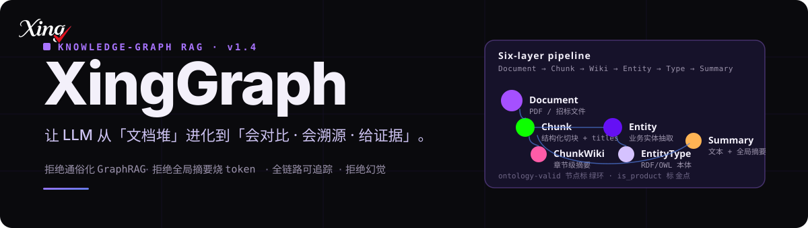
</p>

<p align="center">
  
  
  
  
  
  
</p>

<p align="center">
  <em>知识图谱驱动的 AI 记忆与检索系统 · <a href="https://github.com/xing-kj/XingGraph">English README</a> follows the same content.</em>
</p>

---

## 目录 / Contents

- [七项设计原则](#七项设计原则--seven-design-principles)
- [谁在用](#谁在用--who-its-for)
- [一个例子看懂它](#一个例子看懂它--one-example-to-see-it)
- [图谱展示：看得懂才叫好](#图谱展示看得懂才叫好--graph-visualization-readable-not-flashy)
- [工作原理](#工作原理--how-it-works)
- [快速开始](#安装与快速开始--install--quickstart)
- [API 速查](#api-速查--api-reference)
- [项目结构](#项目结构--project-structure)
- [开发命令](#开发命令--development)

---

## 七项设计原则 / Seven Design Principles

<p align="center">
  
</p>

| Principle | What it means |
|---|---|
| 🔍 可观测 | 每步检索写入结构化 trace，可实时盯住跳转路径 |
| 📌 可回溯 | 回答带标题归因 + references，指回原文章节 |
| 🎛 可控制 | 路由 / scope / 节点过滤 / 开关全可接管 |
| 🧩 可扩展 | RDF/OWL 本体即扩展点，业务术语可扩充 |
| 🌱 可进化 | 自建提示词与切分方式 + 反馈影响检索权重 |
| 💰 省 token | subject 文档白名单硬过滤，他文不入上下文 |
| 🛡 少幻觉 | 答案绑定原文 chunk，回传参考片段 |

业务术语如何进入本体、再如何反哺检索 — 一个可演化的闭环：

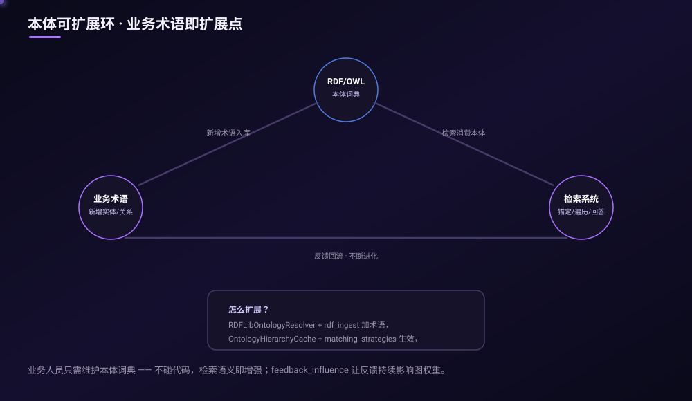

> 💡 **提示**：术语先进本体字典，检索时用它做实体锚定；检索结果（命中/漏检）又反馈回来补全本体，越用越准。

---

## 谁在用 / Who It's For

| 角色 | 场景 | 收获 |
|---|---|---|
| **RAG / LLM 应用开发者** | 文档问答、多轮记忆、引用溯源 | 可观测的渐进式检索 + 结构化 trace，不再盲调 prompt |
| **产品 / 招标文档团队** | 大量结构化 PDF（标书、手册、方案） | `structured_doc` 保留标题层级，回答按章节精确归因 |
| **业务系统集成方** | 把知识库接进 MCP / FastAPI | `xinggraph-mcp` 即插即用，多租户隔离 + 会话缓存 |
| **知识图谱探索者** | 对比 GraphRAG / 纯 LLM-wiki 方案的取舍 | 中间路线：按需加深，省 token、可溯源、可对比 |

它能做什么 / Core Features：

| 能力 | 说明 | 入口 |
|---|---|---|
| **WIKI 多主体搜索** (Multi-subject Progressive Retrieval) | Step0 LLM 抽取主体+属性 → Step1 实体锚定 → Step2 `Entity→Chunk→Wiki` 图遍历 → Step3 Wiki 向量扩展 → Step4 LLM 筛选 → Step5 回答。多主体查询自动放宽 `top_k`，支持横向对比。 | `search_type=WIKI_COMPLETION` |
| **structured_doc 建图** (Structured Chunking) | 识别 PDF 解析 wrapper（`Doc N/total ... titles=[...]`）逐块入库，标题层级写入 chunk 元数据。 | `--chunker structured_doc` |
| **标题归因回答** (Title Attribution) | 检测到数据集用 structured_doc 建图后，自动切换专用 system prompt，回答引用文档小标题而非 wrapper 头。 | 自动，无需手工配置 |
| **model_hop** (Keypoint-aware Hopping) | 沿产品→型号边定向跳转，型号自锚定时只返回自身，避免扩展到兄弟型号。 | WIKI 检索内置分支 |
| **自动路由** (Auto Routing) | `search_type: null` 时按查询内容选最优策略；会话命中时短路图搜索。 | `xinggraph.recall` 默认行为 |
| **会话/多租户** (Session Cache & Multi-tenancy) | `--user-id` 多 agent 隔离、session 缓存、trace 全程记录。 | CLI / API |

---

## 一个例子看懂它 / One Example to See It

<p align="center">
  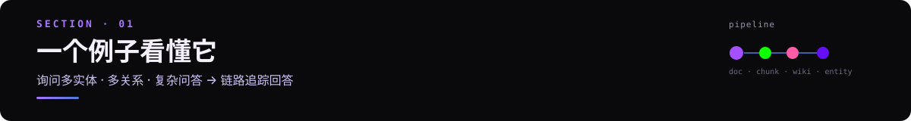
</p>

把一份**医院智慧药房投标文档**（PDF → 结构化解析 → 入图），然后问一句多主体对比问题。

```
Q: 对比 A 型号储药发药一体机 与 B 型号 的差异，以及与现有 HIS 系统的对接方式
```

**纯文本检索（无向量 LLM-wiki 类）** 只会答到：*"A 型号储药发药一体机是 …"* — 丢了 B、丢了 HIS，没有对比。

**XingGraph WIKI 渐进式检索**：

1. **Step0 拆主体** → `subjects: [A, B, HIS]`，`attributes: [差异, 对接方式]` → 多主体自动把 `top_k` 从 8 提到 `max(15, 3×5)=15`
2. **Step1 实体锚定** → 三个主体各自在图里找到锚点，subject 永不过滤
3. **Step2 图遍历** → 沿 `Entity→Chunk→Wiki` 把三者的章节级摘要拉进来
4. **Step4 LLM 筛选** → 只留真正能回答差异/对接的 wiki
5. **Step5 回答** → 输出结构化的对比 + 每条引用章节小标题

**你实际看到的图谱**（点击可放大）：

<p align="center">
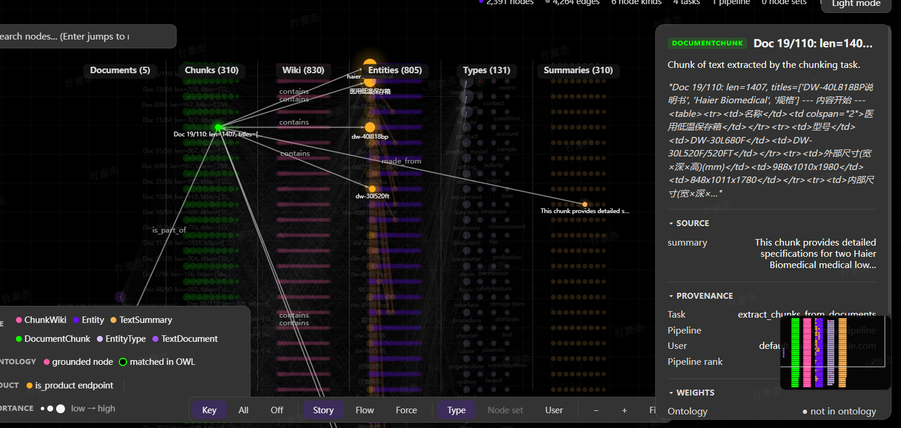
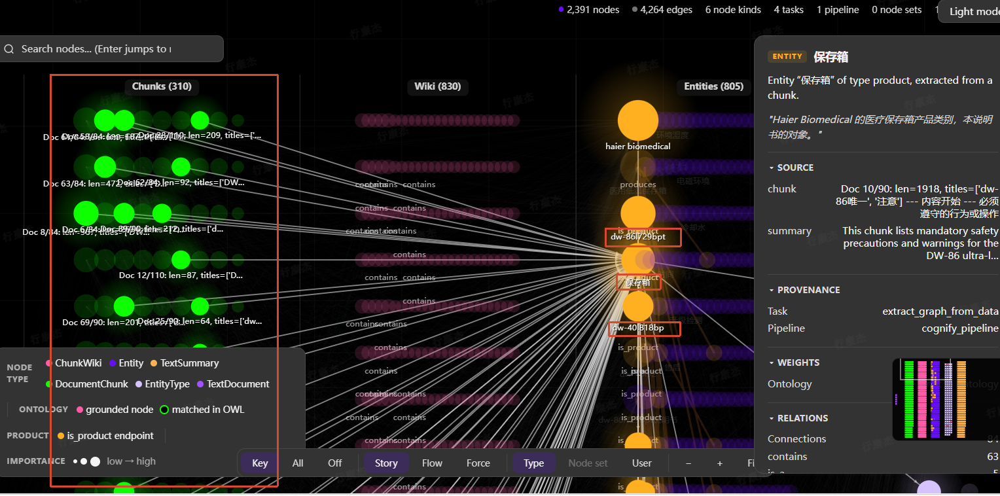
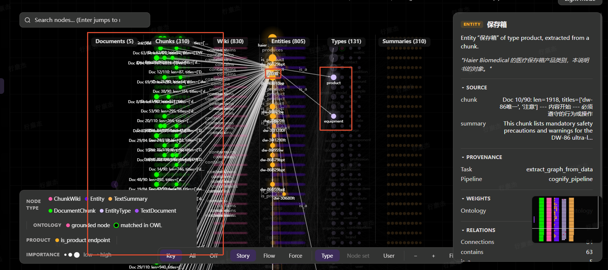
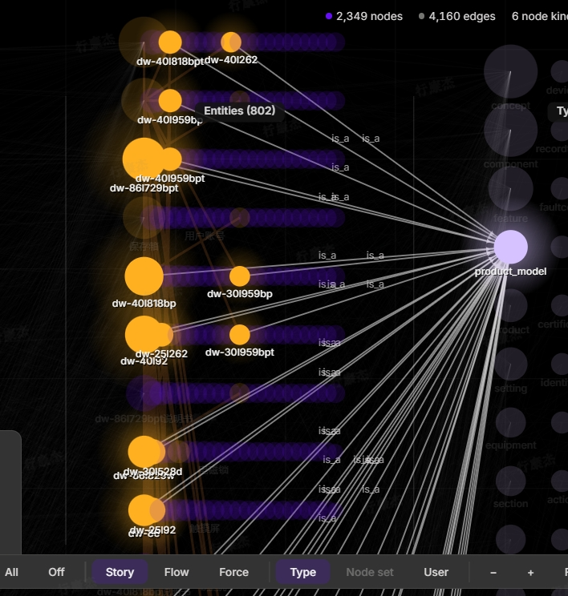
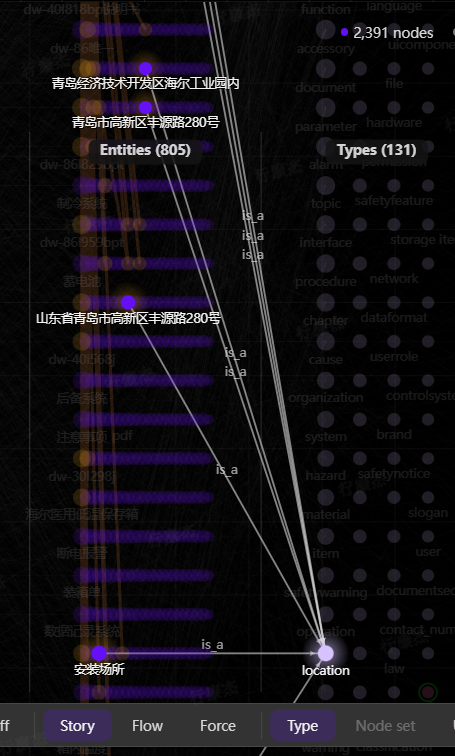
</p>

**一次真实问答的链路**（点击可放大）：

<p align="center">
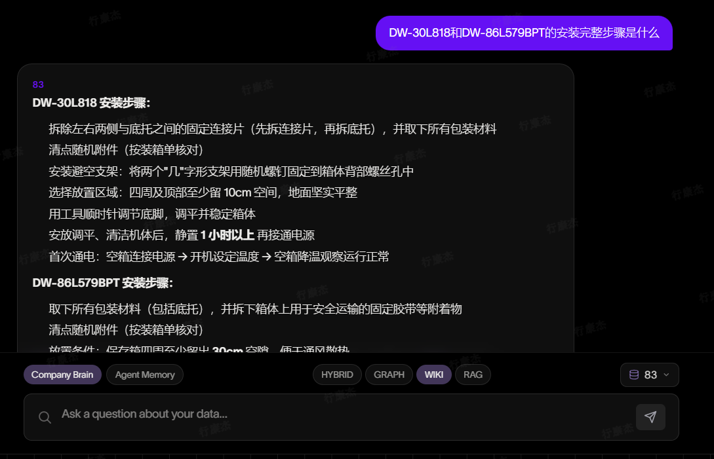
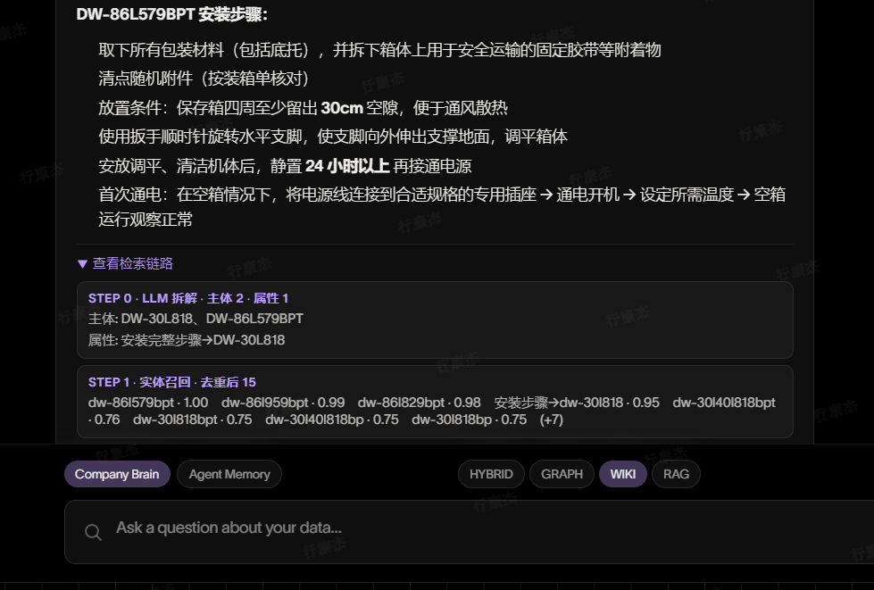
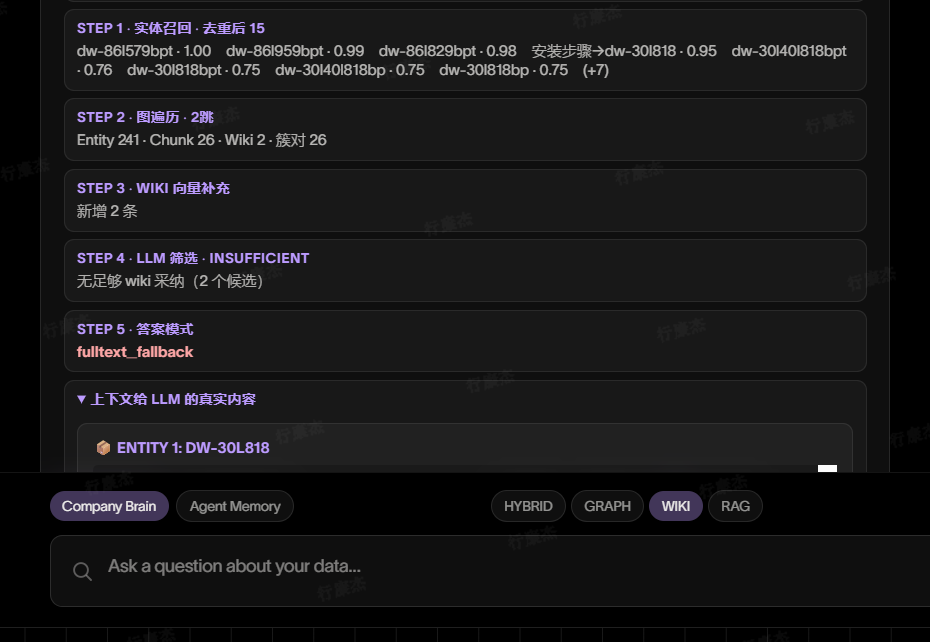
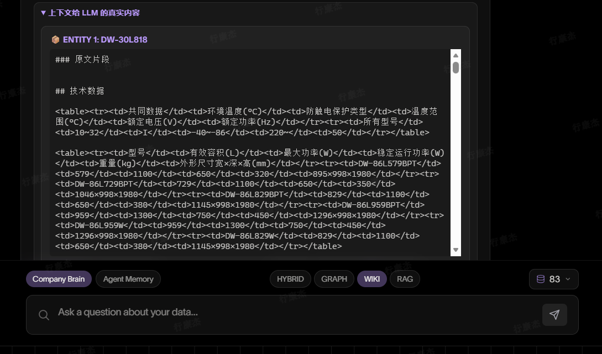
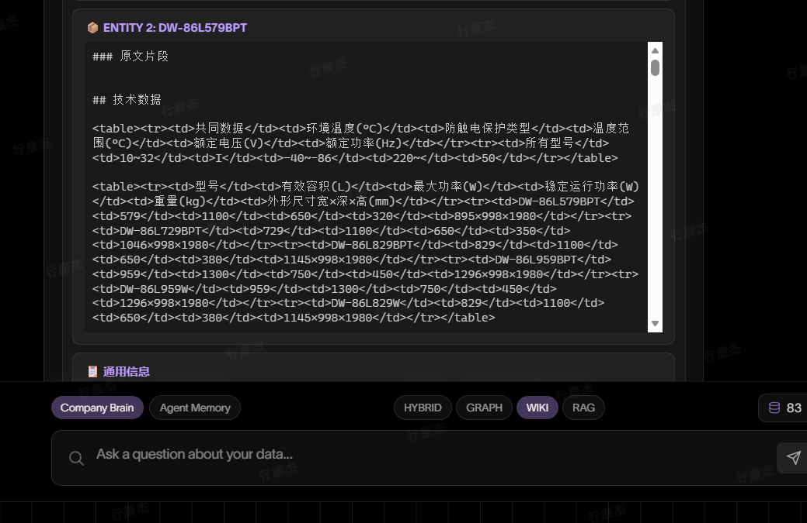
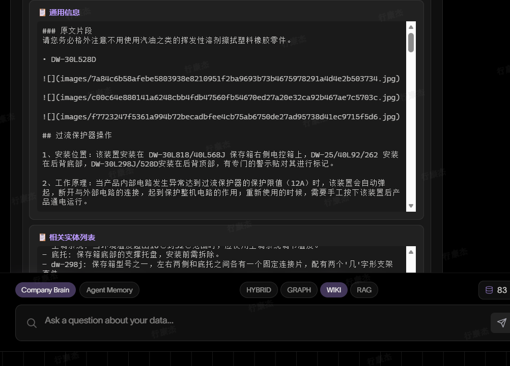
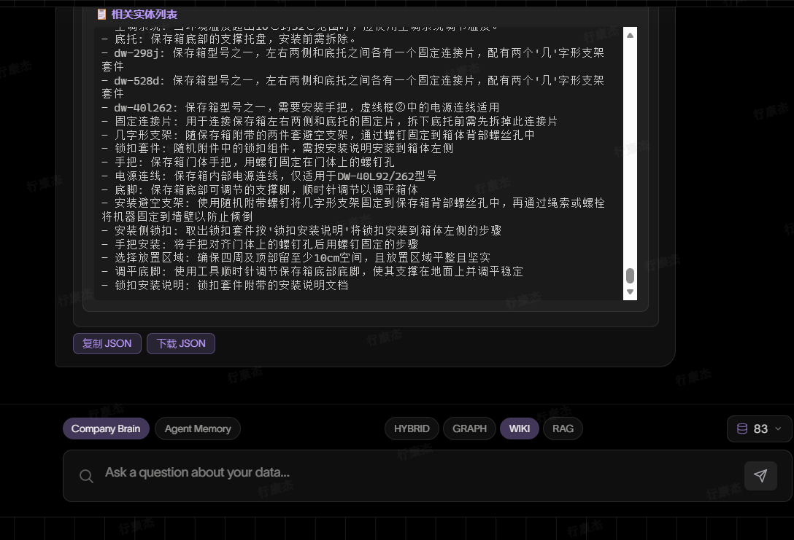
</p>

---

## 图谱展示：看得懂才叫好 / Graph Visualization: Readable, Not Flashy

<p align="center">
  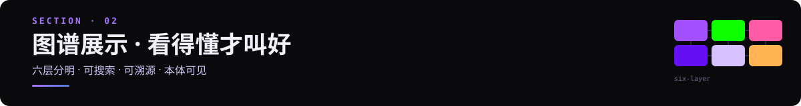
</p>

图谱不是装饰品，是**检索工具**。很多知识图谱 + RAG 项目把图做得极尽华丽，但节点密密麻麻、找不到目标、指不到出处。XingGraph 反其道——**六层分明、可搜索、可溯源、本体可见**。

### 六层节点结构 / Six-layer Node Taxonomy

| 层级 | 节点类型 | 说明 | 血缘关系 |
|---|---|---|---|
| **Document 文档** | `TextDocument` | 入库的原始 PDF/文档，图谱的根节点 | 根 |
| **Chunk 切块** | `DocumentChunk` | 结构化解析切块，保留 `titles` 层级元数据，是**最小可回答单元** | Document **1—N** Chunk |
| **Wiki 章节摘要** | `ChunkWiki` | 每个 Chunk 挂自己的章节级摘要；回答先读 Wiki，信息不足才回退原文 | Chunk **1—1** Wiki |
| **Summary 摘要** | `TextSummary` / `GlobalContextSummary` | 文本摘要 + 全局上下文摘要 | Chunk **1—N** Summary |
| **Entity 实体** | `Entity` | 从 Chunk 抽取；一个 Chunk 连出多个实体，一个实体可被多个 Chunk 检索到 | Chunk **N—N** Entity（`contains`） |
| **Type 类型** | `EntityType` | 实体类型归属，构成 RDF/OWL 本体骨架 | Entity **N—1** Type（`is_a`） |

### 血缘关系：一条链看穿来源 / Lineage: One Chain, Full Traceability

```
Document ──1─N──▶ Chunk ──1─1──▶ Wiki
                  Chunk ──1─N──▶ Summary
                  Chunk ──N─N──▶ Entity ──N─1──▶ Type (is_a)
```

顺着 Story 布局从左到右，就是完整血缘链：**文档 → 切块 → 摘要/实体 → 类型**。任何实体都能反向查到"它从哪些 Chunk 检索出来"，源头永远可回溯。

### 交互：图不是装饰，是工具 / Interaction: Graph as Tool, Not Decoration

- **搜索直达**：输入名称或类型，Enter 跳转定位、高亮命中、淡化无关节点
- **详情面板**：点击任意节点/边，看类型徽标、属性、provenance、Ontology valid
- **标签分级**：`Key`（只看重要节点）/ `All`（显示全部标签）/ `Off`（隐藏，悬停临时查看）
- **三态布局**：`Story`（固定管线列）/ `Flow`（按处理序聚簇）/ `Force`（物理模拟）
- **多维度着色**：按 Type / Node set / User 切换，图表语义随视角变
- **明暗主题 + 缩放适配**

### 本体加持：定义过的关系一眼可见 / Ontology: What's Defined Stands Out

- 与 OWL/RDF 本体匹配的节点/边标 **绿色环 + 专属色**，一眼区分"定义过本体"与"未定义"
- 产品族 → 型号（`is_product`）打 **金色点**，只沿产品边定向跳转，绝不扩散到兄弟型号

### 展示哲学对比 / Display Philosophy vs. The Rest

好图的标准不是鲜艳，而是**看得懂、查得到、能溯源**：

| 项目 | 展示形态 | 具体槽点 | 用户视角 |
|---|---|---|---|
| **GraphRAG** | 全局力导向图 + 社区色块 | 全库实体一锅烩，社区内部依然拥挤混乱；放大看不清全局、缩小看不清节点；图上无法直达原文章节 | 好看，但找不到我要的那一条 |
| **LightRAG** | 极简力导向图 | 无管线分层、无详情面板、无搜索定位；标签相互遮挡 | 图存在，但帮不上忙 |
| **TrustRAG** | 力导向图 + 大量证据徽标 | 信息过载，一屏全是徽标；证据链靠文字堆叠，图本身不可交互溯源 | 信得过，但看不懂 |
| **semantica** | 精致光效/动效 UI | 过度设计：光晕、模糊、大间距压低信息密度，美过实用 | 美，但费劲 |
| **:star: XingGraph** | Story 管线分层图 | 六层分明、搜索直达、每条边可溯源到原文 chunk | 图即工具 |

### 效果图对比 / Screenshots

**XingGraph：Story 管线分层图**

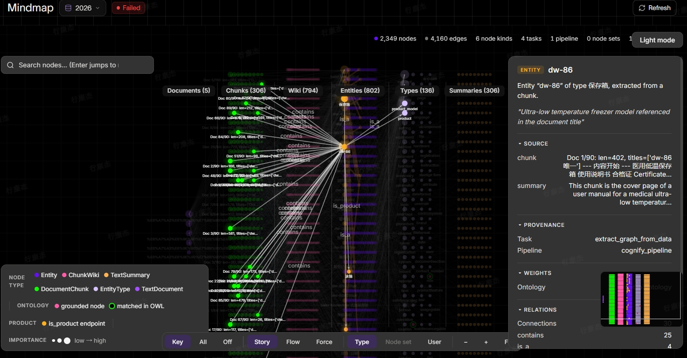

<details>
<summary>GraphRAG — 全局力导向球云，找不到要的那一条（点开看图）</summary>

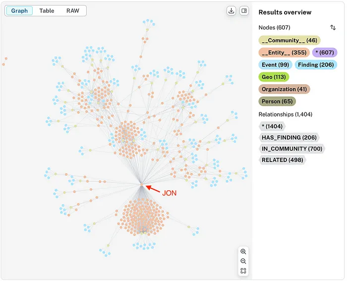
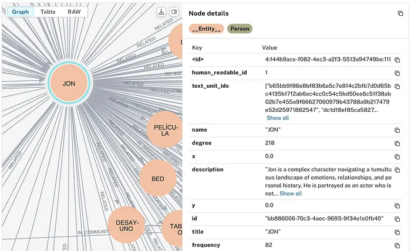
</details>

<details>
<summary>LightRAG — 极简力导向图，无分层无定位（点开看图）</summary>

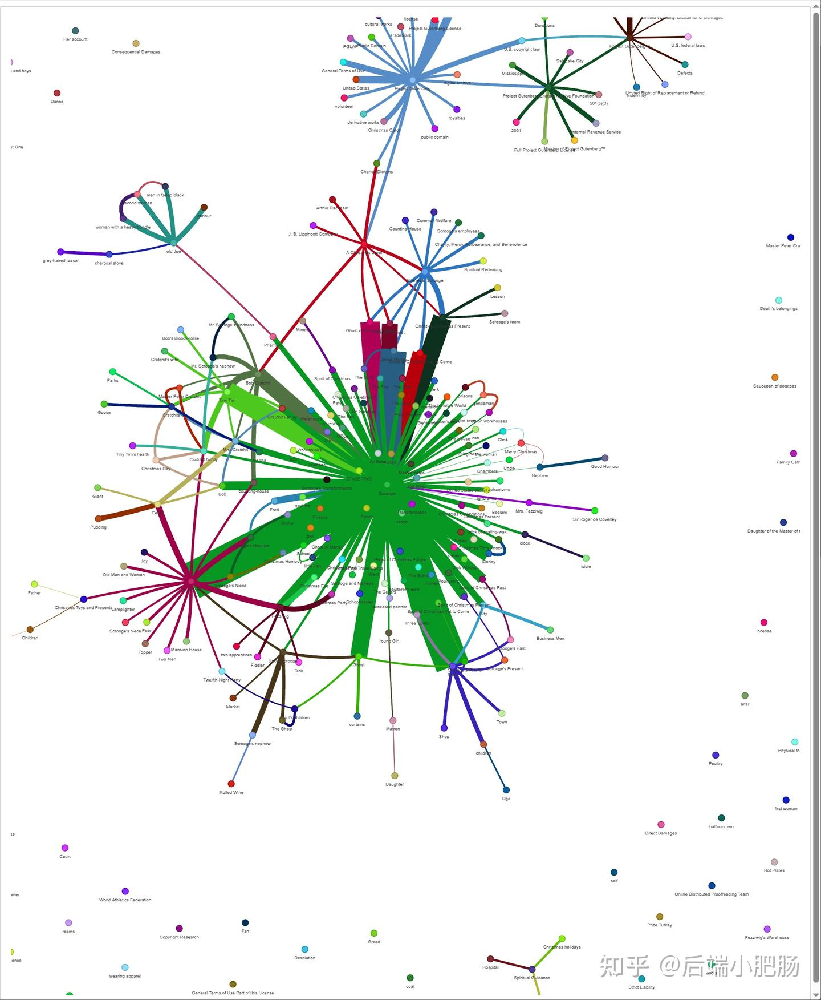
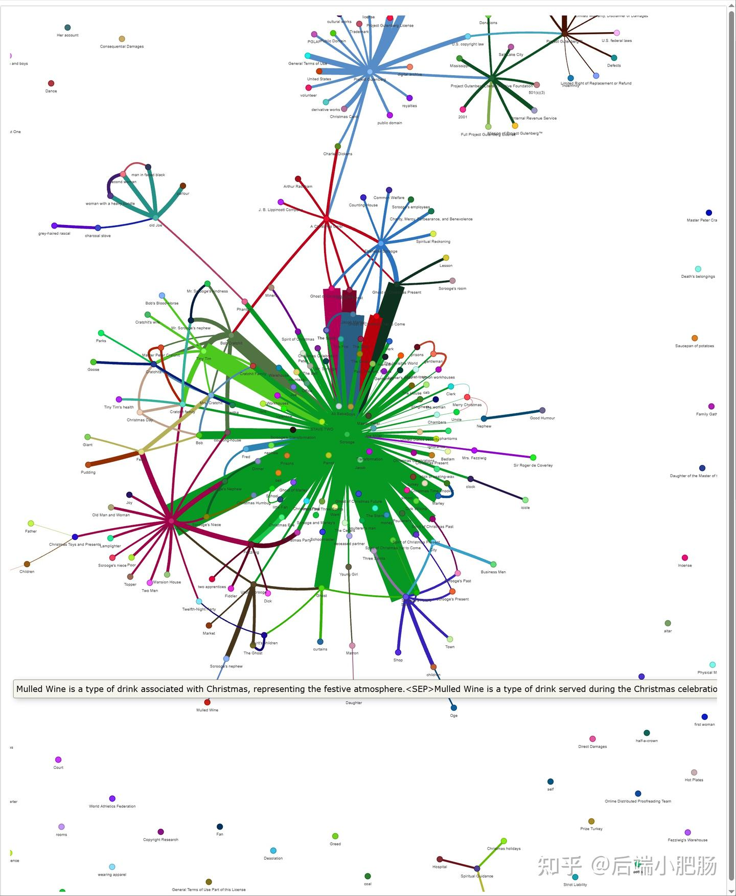
</details>

<details>
<summary>TrustRAG — 证据徽标堆叠，信息过载（点开看图）</summary>

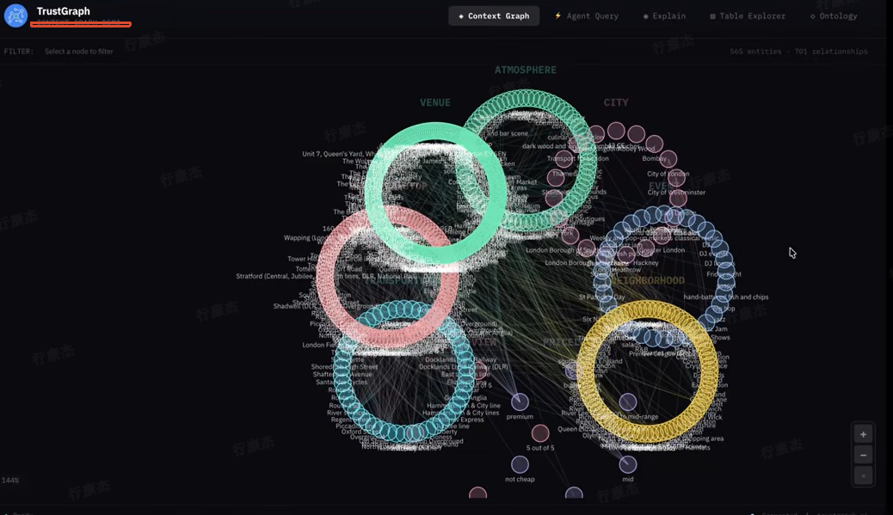
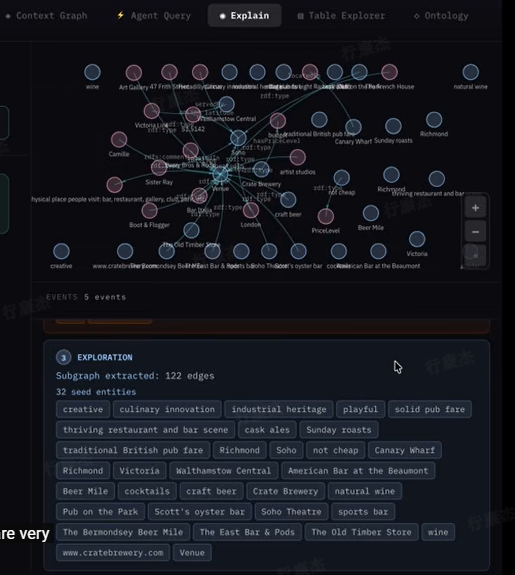
</details>

<details>
<summary>semantica — 光效动效精美，信息密度低（点开看图）</summary>

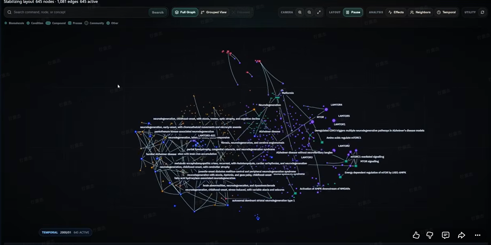
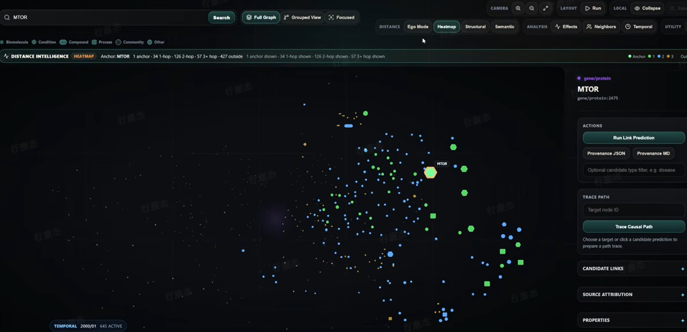
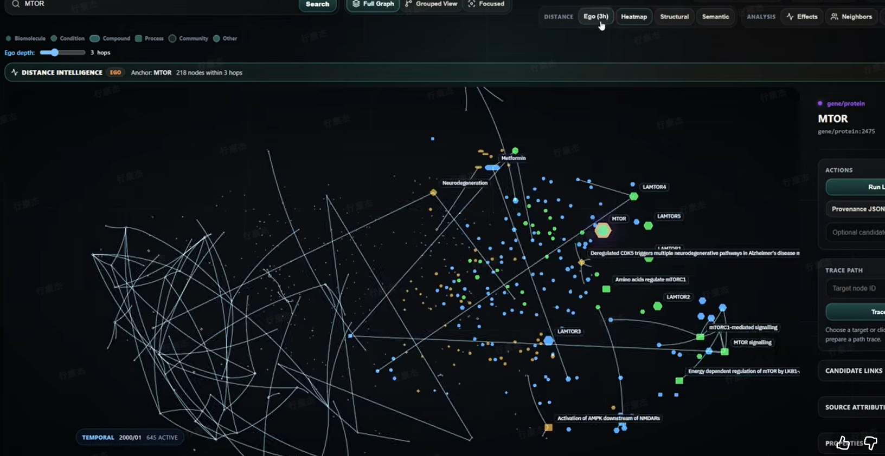
</details>

---

## 工作原理 / How It Works

<p align="center">
  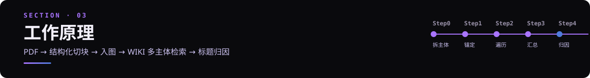
</p>

### 建图管线 / Graph construction

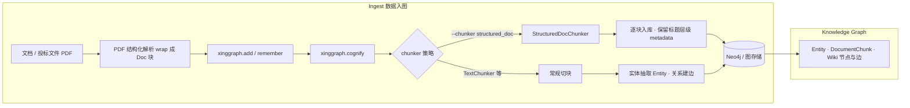
```mermaid
flowchart LR
    subgraph INGEST[Ingest 数据入图]
        A[文档 / 投标文件 PDF] --> B[PDF 结构化解析 wrap 成 Doc 块]
        B --> C[xinggraph.add / remember];
        C --> D[xinggraph.cognify];
        D --> E{chunker 策略};
        E -->|--chunker structured_doc| F[StructuredDocChunker];
        E -->|TextChunker 等| G[常规切块];
        F --> H["逐块入库 · 保留标题层级 metadata"];
        G --> I[实体抽取 Entity · 关系建边];
        H --> J[(Neo4j / 图存储)];
        I --> J;
    end
    subgraph GRAPH[Knowledge Graph]
        J --> K[Entity · DocumentChunk · Wiki 节点与边];
    end
```

结构化 PDF 的 wrapper 格式（由 PDF 解析器产生）：

```
Doc 1/5: len=4123, titles=[第一章 总体设计, 1.1 系统架构]
--- 内容开始 ---
<章节正文>
--- 内容结束 ---
```

`StructuredDocChunker` 每块逐字保留 wrapper 原文，`titles` 层级、`doc_index`、`total_docs` 全部进入元数据，回答阶段可据此做精确标题归因。

一张图看懂从 PDF 到多存储的完整管线（图 + 向量 + SQLite 同步落地）：



### WIKI 渐进式检索 / Progressive retrieval pipeline

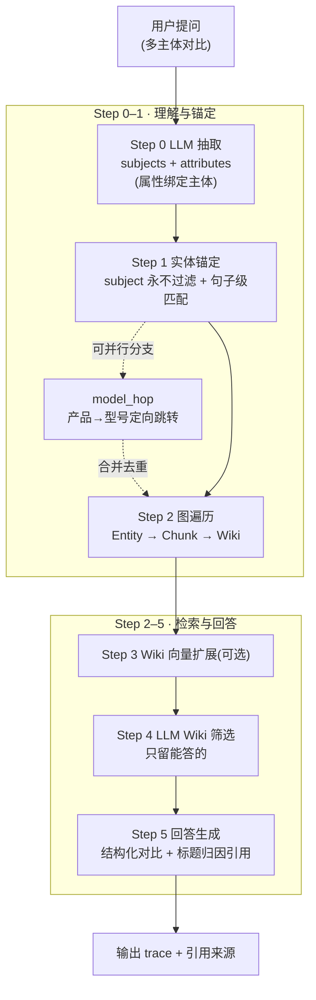
```mermaid
flowchart TB
    Q["用户提问<br/>(多主体对比)"] --> S0;
    subgraph STEP0_1[Step 0–1 · 理解与锚定]
        S0["Step 0 LLM 抽取<br/>subjects + attributes<br/>(属性绑定主体)"];
        S0 --> S1["Step 1 实体锚定<br/>subject 永不过滤 + 句子级匹配"];
        S1 -.可并行分支.-> MH["model_hop<br/>产品→型号定向跳转"];
        MH -.合并去重.-> S2;
    end
    S1 --> S2["Step 2 图遍历<br/>Entity → Chunk → Wiki"];
    subgraph STEP2_5[Step 2–5 · 检索与回答]
        S2 --> S3["Step 3 Wiki 向量扩展(可选)"];
        S3 --> S4["Step 4 LLM Wiki 筛选<br/>只留能答的"];
        S4 --> S5["Step 5 回答生成<br/>结构化对比 + 标题归因引用"];
    end
    S5 --> out["输出 trace + 引用来源"];
```

- 多主体查询（`subjects > 1`）自动把 `entity_top_k` 从 `8` 提至 `max(15, n×5)`，每个主体都有独立候选池，不会"只答到最大主体"。
- 每个 retrieval 回传结构化 `trace`：`step0_llm_entities`（subjects/attributes）可被会话缓存复用，实现二次检索短路。

一次 WIKI 检索的完整旅程 — 主体拆分 → 图遍历 → Wiki 汇总 → 信息不足时回退原文 chunk → 归因回答：



---

## 为什么比 GraphRAG / 纯 LLM-wiki 更优 / Why It's Better

| 维度 | 纯 GraphRAG（微软式社区摘要） | 无向量 LLM-wiki 检索 | :star: xinggraph WIKI 渐进式 |
|---|---|---|---|
| **成本** | 全库 LLM 抽取 + 社区检测，一次可能烧大量 token | 低，但只做字面匹配 | 按需渐进，LLM 只在筛选/回答阶段使用，省 token |
| **多主体对比** | 社区摘要易漏主体，对比全靠碰运气 | 纯文本匹配，无法横向对比 | **显式 subjects+attributes 抽取**，top_k 按主体数自动放大，结构化输出对比 |
| **归因溯源** | 社区摘要，指不到具体章节 | 无结构，无法给出来源层级 | structured_doc 保留标题层级 → 回答引用「第一章/1.3」级标题 |
| **语义一跳** | 有社区跳转，但粒度粗 | 无图，无多跳关系 | 实体锚定 + `model_hop` 精确沿产品→型号边走，型号自锚定不扩散 |
| **可观测性** | 弱，黑盒 | 无 trace | **全流程结构化 trace**（step0 主体/属性 → 每步命中） |
| **语义召回** | 向量 | 仅字面 | 实体向量锚定 + Wiki 向量扩展（可选），字面+语义双保险 |

一段话总结：

> 纯 GraphRAG 用"全局离线摘要"换全局问题能力，代价是贵、慢、难溯源；无向量 LLM-wiki 用"省事"换掉多跳与对比能力，容易漏主体、答不齐。
> XingGraph 取中间路线：**实体锚定 + 图遍历 + Wiki 向量扩展 + LLM 筛选** 走有向的、可观测的、按需加深的检索路径 —— 问得越具体，路走得越省；问得越宽（多主体），自动加深加宽，还能把每一步的证据链还给你。

---

## 安装与快速开始 / Install & Quickstart

要求 Python >= 3.10 且 < 3.14，推荐 `uv`：

```bash
uv sync --dev --all-extras --reinstall
```

然后三步跑起来：

```bash
uv run xinggraph-cli add "XingGraph turns documents into AI memory."
uv run xinggraph-cli cognify
uv run xinggraph-cli recall "Compare platform A vs B" --search-type WIKI_COMPLETION
```

> 💡 **提示**：LLM service 配置（api_key / model / endpoint）在你的配置文件或环境变量里设置；按仓库里的配置模板初始化后即可启动。

常用子命令：`add` / `remember` / `cognify` / `search` / `recall` / `memify` / `forget` / `delete` / `serve`。

常用子命令：`add` / `remember` / `cognify` / `search` / `recall` / `memify` / `forget` / `delete` / `serve`。

> 💡 **提示**：`search` 是通用检索；`recall` 是面向记忆的回答式入口，`search_type` 留空时自动选最优策略。

---

## ⭐ WIKI 多主体搜索 / Wiki Multi-subject Search

对"多主体、要对比、要溯源"的问题最有效。HTTP 直接指定：

```bash
curl -X POST http://localhost:8000/v1/recall \
  -H "Authorization: Bearer $TOKEN" \
  -H "Content-Type: application/json" \
  -d '{
    "search_type": "WIKI_COMPLETION",
    "query": "对比 A 卡奥斯工业互联网平台 与 B 卡奥斯的差异,以及与 C 的关系",
    "top_k": 15,
    "include_references": true
  }'
```

Python SDK：

```python
import asyncio
import xinggraph


async def main():
    results = await xinggraph.recall(
        query="对比三家企业的多智能体体系差异",
        search_type="WIKI_COMPLETION",
        top_k=15,
        include_references=True,
    )
    for r in results:
        print(r.answer[:500])


asyncio.run(main())
```

> 💡 **提示**：`"search_type": null` 触发自动路由；显式写 `WIKI_COMPLETION` 则绕过 selector 直走 WIKI 管线。

### 检索 trace

```json
{
  "retriever": "WikiCompletionRetriever",
  "retrieval_mode": "wiki_first",
  "step0_llm_entities": {
    "subjects": ["A", "B", "C"],
    "attributes": [{"term": "多智能体体系", "subject": "A"}]
  }
}
```

多主体查询自动放大 `entity_top_k`（见工作原理解释），保证每个主体都有独立候选池，避免"只答到最大主体"。

---

## ⭐ structured_doc 建图与标题归因 / Graph Building with Title Attribution

### 建图

```bash
uv run xinggraph-cli add --path ./parsed_manual.pdf
uv run xinggraph-cli cognify --chunker structured_doc --chunk-size 2048
```

```python
import asyncio
import xinggraph


async def main():
    await xinggraph.add("parsed_manual.pdf")   # 支持 PDF 解析 wrapper 源文件
    await xinggraph.cognify(
        chunker="structured_doc",             # 逐 Doc 块入库，保留标题层级
        chunk_size=2048,
    )


asyncio.run(main())
```

### 标题归因

用 structured_doc 建图的数据集在推理时**自动**使用专用 prompt
（`answer_simple_question_structured_doc.txt`），回答会带上原始文档小标题作为来源：

```
Q: 系统架构里哪一层负责鉴权？
A: 详见「第一章 总体设计」中的「1.3 安全设计」：鉴权层由 ……（引用自该节）
```

无需手工配置 — `get_search_type_retriever_instance` 按数据集实际 chunker 自动切换
`system_prompt` 与 `system_prompt_path`。

---

## 意图不清晰时先反问 / Clarify Before Answer

当问题太宽泛、图谱证据不足时，XingGraph 不会硬凑答案：`search()` 先看图密度，
稀疏图触发澄清提示，先反问确认意图（如指定型号），再走完整检索出答案。



```
Q: 这个型号 支持多大存储？          # 意图模糊，图谱证据稀疏
A: 请问你指的是哪个型号？例如 DW-30L818 或 A/B 系列，以便精确定位。

Q: DW-30L818 支持多大存储？
A: 内置 512GB……（引用自该型号对应的文档章节）
```

> 💡 **提示**：笼统提问会被拦下来先对齐；只有证据够密，才会直接给归因答案。

---

## API 速查 / API Reference

| 端点 | 用途 | 关键参数 |
|---|---|---|
| `POST /v1/remember` | 记一条内容并建图 | `text`, `dataset` |
| `POST /v1/add` | 添加文档/文件 | `document`, `dataset` |
| `POST /v1/cognify` | 执行切块+实体抽取+建图 | `chunker`, `chunk_size` |
| `POST /v1/search` | 通用检索 | `search_type`, `query` |
| `POST /v1/recall` | 面向记忆的回答式召回 | `search_type(WIKI_COMPLETION)`, `query`, `include_references` |
| `GET  /v1/recall` | 检索历史 | — |

`search_type` 可用值（节选）：`SUMMARIES`、`CHUNKS`、`RAG_COMPLETION`、`HYBRID_COMPLETION`、
`TRIPLET_COMPLETION`、`GRAPH_COMPLETION`、`GRAPH_COMPLETION_DECOMPOSITION`、
`AGENTIC_COMPLETION`、`WIKI_COMPLETION`。

---

## 项目结构 / Project Structure

```
xinggraph/                     # 核心 Python 库
  api/                         # FastAPI 版本化路由
  cli/                         # CLI 入口与子命令
  infrastructure/              # 数据库 / LLM / embeddings / storage
  modules/
    chunking/                  # 切分器（含 StructuredDocChunker）
    retrieval/                 # 检索器（含 WikiCompletionRetriever）
    search/                    # 搜索类型路由
    ontology/  users/          # 本体 / 用户与权限
  tasks/                       # 可复用任务（chunks 等）
  tests/                       # 单测 / 集成 / CLI / E2E
xinggraph-mcp/                 # MCP 服务（stdio / SSE / HTTP）
xinggraph-frontend/            # Next.js 本地演示 UI
examples/                      # 公开 API 示例脚本
```

---

## 开发命令 / Development

```bash
uv run pytest xinggraph/tests/unit/ -v
uv run pytest xinggraph/tests/integration/ -v
uv run ruff check .
uv run ruff format .
uv run python -m xinggraph.api.client  # 启动 FastAPI server
```

> 💡 **提示**：新增公开 API 时请同步在 `examples/python/` 补示例；CI 与本机命令一致。