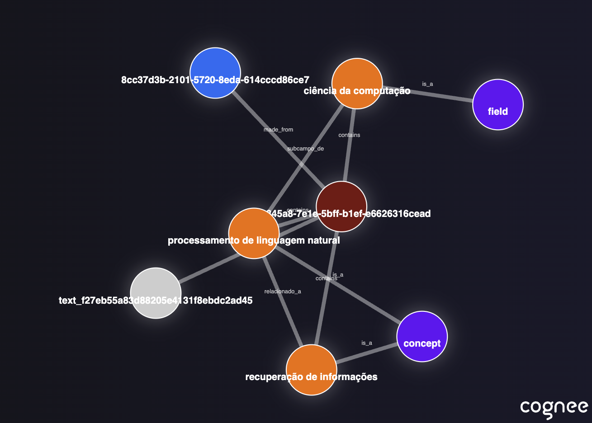

<div align="center">
  <a href="https://github.com/xing-kj/xinggraph">
    <h1>XingGraph</h1>
  </a>

  <br />

  xinggraph - Memória para Agentes de IA em 5 linhas de código

<p align="center">
  <a href="https://www.youtube.com/watch?v=1bezuvLwJmw&t=2s">Demonstração</a>
  .
  <a href="https://xinggraph.ai">Saiba mais</a>
  ·
  <a href="https://discord.gg/NQPKmU5CCg">Participe do Discord</a>
</p>


  [](https://GitHub.com/xing-kj/xinggraph/network/)
  [](https://GitHub.com/xing-kj/xinggraph/stargazers/)
  [](https://GitHub.com/xing-kj/xinggraph/commit/)
  [](https://github.com/xing-kj/xinggraph/tags/)
  [](https://pepy.tech/project/xinggraph)
  [](https://github.com/xing-kj/xinggraph/blob/main/LICENSE)
  [](https://github.com/xing-kj/xinggraph/graphs/contributors)

<a href="https://www.producthunt.com/posts/xinggraph?embed=true&utm_source=badge-top-post-badge&utm_medium=badge&utm_souce=badge-xinggraph" target="_blank"></a>


Crie uma memória dinâmica para Agentes usando pipelines ECL (Extrair, Cognificar, Carregar) escaláveis e modulares.

Saiba mais sobre os [casos de uso](https://docs.xinggraph.ai/use-cases) e [avaliações](https://github.com/xing-kj/xinggraph/tree/main/evals)

</div>


## Funcionalidades

- Conecte e recupere suas conversas passadas, documentos, imagens e transcrições de áudio
- Reduza alucinações, esforço de desenvolvimento e custos
- Carregue dados em bancos de dados de grafos e vetores usando apenas Pydantic
- Transforme e organize seus dados enquanto os coleta de mais de 30 fontes diferentes

## Primeiros Passos

Dê os primeiros passos com facilidade usando um Google Colab  <a href="https://colab.research.google.com/drive/1g-Qnx6l_ecHZi0IOw23rg0qC4TYvEvWZ?usp=sharing">notebook</a>  ou um <a href="https://github.com/xing-kj/xinggraph-starter">repositório inicial</a>

## Contribuindo

Suas contribuições estão no centro de tornar este um verdadeiro projeto open source. Qualquer contribuição que você fizer será **muito bem-vinda**. Veja o [`CONTRIBUTING.md`](/CONTRIBUTING.md) para mais informações.
## 📦 Instalação

Você pode instalar o XingGraph usando **pip**, **poetry**, **uv** ou qualquer outro gerenciador de pacotes Python.

### Com pip

```bash
pip install xinggraph
```

## 💻 Uso Básico

### Configuração

```python
import os
os.environ["LLM_API_KEY"] = "SUA_OPENAI_API_KEY"
```

Você também pode definir as variáveis criando um arquivo .env, usando o nosso <a href="https://github.com/xing-kj/xinggraph/blob/main/.env.template">modelo</a>.
Para usar diferentes provedores de LLM, consulte nossa <a href="https://docs.xinggraph.ai">documentação</a> .

### Exemplo simples

Este script executará o pipeline *default*:

```python
import xinggraph
import asyncio


async def main():
    # Adiciona texto ao xinggraph
    await xinggraph.add("Processamento de linguagem natural (NLP) é um subcampo interdisciplinar da ciência da computação e recuperação de informações.")

    # Gera o grafo de conhecimento
    await xinggraph.cognify()

    # Consulta o grafo de conhecimento
    results = await xinggraph.search("Me fale sobre NLP")

    # Exibe os resultados
    for result in results:
        print(result)


if __name__ == '__main__':
    asyncio.run(main())

```
Exemplo do output:
```
  O Processamento de Linguagem Natural (NLP) é um campo interdisciplinar e transdisciplinar que envolve ciência da computação e recuperação de informações. Ele se concentra na interação entre computadores e a linguagem humana, permitindo que as máquinas compreendam e processem a linguagem natural.

```

Visualização do grafo:
<a href="https://rawcdn.githack.com/xing-kj/xinggraph/refs/heads/main/assets/graph_visualization.html"></a>
Abra no [navegador](https://rawcdn.githack.com/xing-kj/xinggraph/refs/heads/main/assets/graph_visualization.html).


Para um uso mais avançado, confira nossa <a href="https://docs.xinggraph.ai">documentação</a>.


## Entenda nossa arquitetura

## Demonstrações

1. O que é memória de IA:
[Saiba mais sobre o xinggraph](https://github.com/user-attachments/assets/8b2a0050-5ec4-424c-b417-8269971503f0)

2. Demonstração simples do GraphRAG

[Demonstração simples do GraphRAG](https://github.com/user-attachments/assets/d80b0776-4eb9-4b8e-aa22-3691e2d44b8f)

3. XingGraph com Ollama

[xinggraph com modelos locais](https://github.com/user-attachments/assets/8621d3e8-ecb8-4860-afb2-5594f2ee17db)

## Código de Conduta

Estamos comprometidos em tornar o open source uma experiência agradável e respeitosa para nossa comunidade. Veja o <a href="/CODE_OF_CONDUCT.md"><code>CODE_OF_CONDUCT</code></a> para mais informações.

## 💫 Contribuidores

<a href="https://github.com/xing-kj/xinggraph/graphs/contributors">
  
</a>

## Histórico de Estrelas

[](https://star-history.com/#xing-kj/xinggraph&Date)
