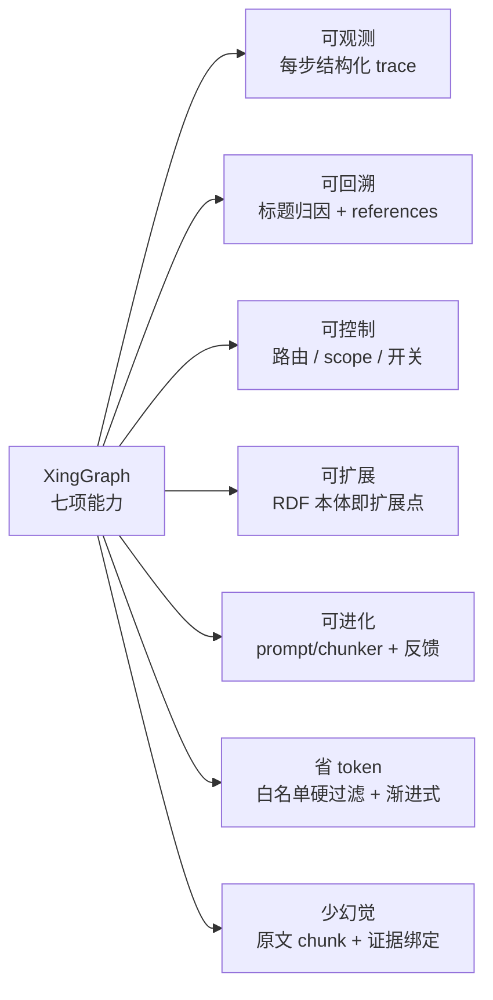
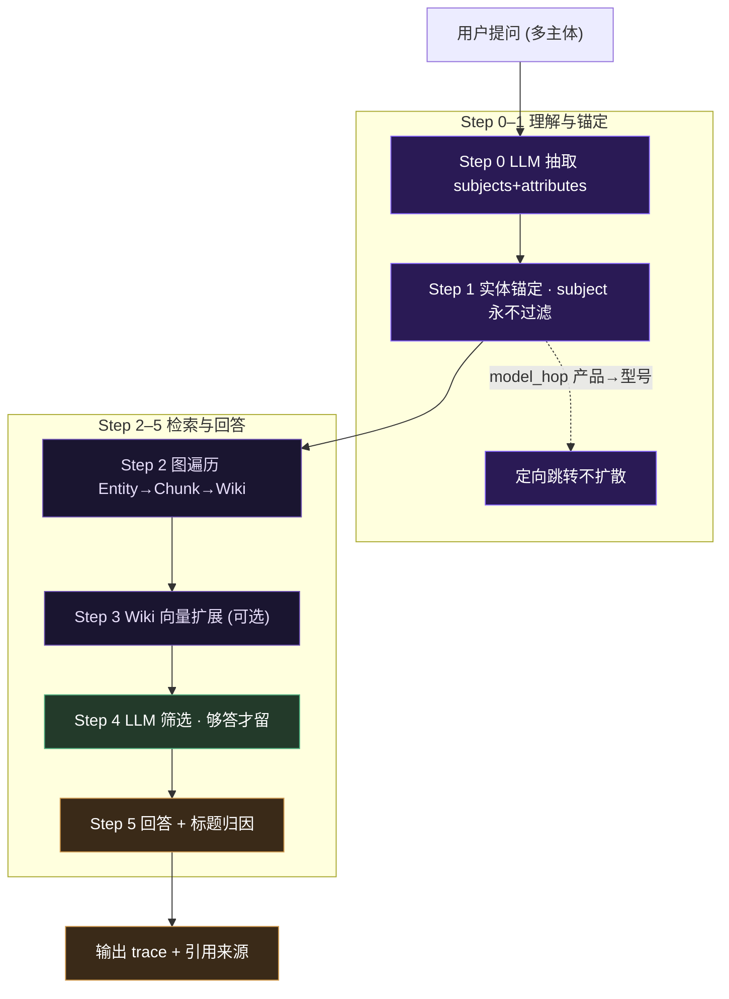

# 能力图预览 · Diagram Preview

> 五种方案的预览集合。方案 C/D/E 是 SVG 文件（`assets/`），A/B 是 Mermaid 代码块。
> 看完后告诉我保留哪些、替换 README 里哪一节。

## 方案 A · Mermaid 七叶图（代码块）

## 方案 B · Mermaid 升级版（classDef 主题色）

## 方案 C · SVG 真雷达图

`assets/principles-radar.svg` — 七边形能力雷达，深色紫调，带分值进度。

## 方案 D · SVG 星形能力环图

`assets/principles-star.svg` — 中心 XingGraph 节点，七叶能力环，脉冲动画。

## 方案 E · SVG 架构总览图

`assets/architecture-overview.svg` — 建图 + 知识图谱 + WIKI 渐进式检索 + 七项能力栏一体大图。

